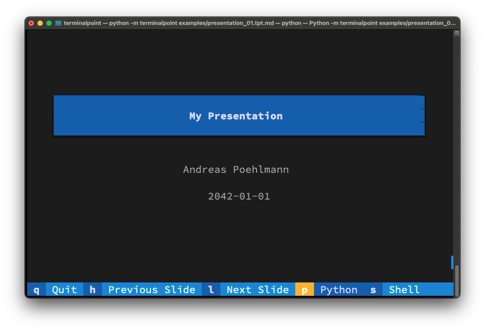

# TerminalPoint

TerminalPoint is PowerPoint for your terminal with no features and only the most
essential functionality. :sloth:

## Features

TerminalPoint is packed with features:

- :sparkles: **Next Slide!** go to the next slide on keypress
- :sparkles: **Previous Slide!** go to the previous slide on keypress
- :sparkles: **Quit!** quit the presentation on keypress

## Look and Feel

It's basically like a real PowerPoint presentation, but in your terminal:




## The TerminalPoint file format (tpt)

TerminalPoint presentations are written in the `tpt` file format. Files end with
a `.tpt.md` suffix, because they are actually just markdown. If you want to
indicate a new slide you have to fill a line with only `-` dashes.

The `######` h6 header is misused to center a line of text.

## Special Features

- :hatched_chick: **Toggle Dark Mode** by pressing `d` (hidden feature)
- :whale: **Reload slides** by pressing `r` (hidden feature)
- :snake: **Launch Python** by pressing `p`
- :owl: **Launch a Shell** by pressing `s`

## Requirements

You need Python and a terminal.

## Installation

You can install *TerminalPoint* via [pip](https://pip.pypa.io/):

```shell
$ pip install terminalpoint
```

Although I recommend installation via `pipx`.

## Example

After installation you can download the example [here](https://github.com/ap--/terminalpoint/raw/main/examples/presentation_01.tpt.md)
and try it with:

```console
$ terminalpoint presentation_01.tpt.md
```

## Contributing

Contributions are very welcome :heart:

## License

Released under the [MIT license](LICENSE).
*TerminalPoint* is free and open source software.

## Issues

If you encounter any problems,
please [file an issue](https://github.com/ap--/terminalpoint/issues) along with
a detailed description.
